# Ecolibrium DevOps Assignment

## Project Overview

This project demonstrates a complete DevOps workflow for deploying a lightweight Python Flask application on Amazon EKS using Terraform, Docker, Helm, and Jenkins CI/CD.

The project focuses on implementing production-style DevOps practices including:

- Infrastructure as Code using Terraform
- Kubernetes orchestration using Amazon EKS
- Containerization using Docker
- Container registry integration using Amazon ECR
- Helm-based Kubernetes deployments
- CI/CD automation using Jenkins
- Secure AWS authentication using IAM Instance Profiles

---

# Architecture

## Application Architecture

```text
Internet
   ↓
AWS LoadBalancer
   ↓
Kubernetes Service
   ↓
Flask Pods
   ↓
Docker Container
   ↓
Amazon ECR
```

---

## CI/CD Workflow

```text
GitHub
   ↓
Jenkins Pipeline
   ↓
Terraform Apply
   ↓
Docker Build
   ↓
Push Image To ECR
   ↓
Update kubeconfig
   ↓
Helm Upgrade/Install
   ↓
Deploy To Amazon EKS
```

---

# Technology Stack

| Technology | Purpose |
|---|---|
| AWS | Cloud Infrastructure |
| Terraform | Infrastructure as Code |
| Amazon EKS | Kubernetes Cluster |
| Docker | Containerization |
| Amazon ECR | Container Registry |
| Helm | Kubernetes Package Manager |
| Jenkins | CI/CD Automation |
| Kubernetes | Container Orchestration |
| Python Flask | Lightweight Web Application |

---

# Project Structure

```text
ecolibrium-devops-assignment/
│
├── app/
│   ├── app.py
│   ├── requirements.txt
│   └── Dockerfile
│
├── terraform/
│   ├── provider.tf
│   ├── backend.tf
│   ├── variables.tf
│   ├── vpc.tf
│   ├── iam.tf
│   ├── eks.tf
│   ├── ecr.tf
│   └── outputs.tf
│
├── helm/
│   └── flask-app/
│       ├── Chart.yaml
│       ├── values.yaml
│       └── templates/
│           ├── deployment.yaml
│           ├── service.yaml
│           ├── ingress.yaml
│           ├── configmap.yaml
│           └── _helpers.tpl
│
├── screenshots/
├── Jenkinsfile
└── README.md
```

---

# Bootstrap Instructions

The initial bootstrap setup was intentionally performed manually before Terraform automation.

The following components were created manually:

- Jenkins EC2 instance
- Terraform remote backend S3 bucket
- IAM Role and IAM Instance Profile for Jenkins EC2

## Why Manual Bootstrap?

This approach was chosen to avoid circular dependency issues during infrastructure provisioning.

Example:

- Terraform requires an existing backend bucket to store remote state
- Jenkins requires AWS permissions before Terraform can provision infrastructure
- IAM Instance Profiles must already exist before Jenkins can authenticate securely to AWS

By creating these foundational resources manually, the remaining infrastructure could then be fully automated using Terraform.

---

# Phase 1 — Bootstrap Setup

Completed:
- Created GitHub repository
- Configured Terraform S3 backend
- Created Jenkins EC2 instance manually
- Configured IAM Instance Profile
- Installed:
  - Jenkins
  - Docker
  - Terraform
  - kubectl
  - Helm
  - AWS CLI

Key Concepts:
- IAM Instance Profiles
- Secure AWS Authentication
- Terraform Remote State
- Jenkins Setup

---

# Phase 2 — Terraform Networking

Implemented using Terraform:
- VPC
- Public Subnets
- Private Subnets
- Internet Gateway
- NAT Gateway
- Elastic IP
- Route Tables
- Route Table Associations

Added EKS subnet tags for:
- External LoadBalancers
- Internal LoadBalancers

Key Concepts:
- Production VPC Architecture
- Public vs Private Subnets
- NAT Gateway Architecture
- EKS Networking

---

# Phase 3 — Amazon EKS Setup

Implemented:
- EKS Cluster
- Managed Node Group
- IAM Roles
- IAM Policy Attachments

Verified:
- Worker nodes joined cluster successfully
- kubectl access configured

Key Concepts:
- EKS Control Plane
- Worker Nodes
- Kubernetes Authentication
- IAM Integration with EKS

---

# Phase 4 — Amazon ECR Integration

Implemented:
- ECR Repository using Terraform
- Docker authentication to ECR
- Image scanning enabled

Authentication Method:
- IAM Instance Profile
- AWS STS temporary credentials

Key Concepts:
- Container Registries
- Secure Authentication
- Docker Push Workflow

---

# Phase 5 — Flask Application Containerization

Created:
- Flask application
- Dockerfile
- requirements.txt

Application Endpoints:
- /
- /health

Docker image successfully:
- built
- tested
- pushed to Amazon ECR

Key Concepts:
- Docker Image Lifecycle
- Containerization
- Port Mapping
- Docker Build and Push

---

# Phase 6 — Kubernetes Deployment using Helm

Created Helm chart with:
- Deployment
- Service
- ConfigMap
- Ingress
- VolumeMounts
- Environment Variables
- Liveness Probes
- Readiness Probes

Successfully verified:
- Pods
- Services
- LoadBalancer
- Application accessibility

Key Concepts:
- Helm Templating
- Kubernetes Services
- ConfigMaps
- Liveness vs Readiness Probes
- AWS LoadBalancer Integration

---

# Phase 7 — Jenkins CI/CD Pipeline

Implemented Jenkins pipeline stages:

- Checkout Code
- Terraform Init
- Terraform Apply
- Docker Build
- Docker Push to ECR
- Update kubeconfig
- Helm Deploy
- Deployment Verification

Pipeline automated:
- Infrastructure provisioning
- Container build
- Container push
- Kubernetes deployment

Key Concepts:
- CI/CD Automation
- Jenkins Pipelines
- Infrastructure Automation
- Deployment Automation

---

# Security Practices

The project follows multiple DevOps security best practices:

- No hardcoded AWS credentials
- Authentication handled using IAM Instance Profiles
- AWS STS temporary credentials used automatically
- Terraform remote state stored securely in Amazon S3
- No public Terraform modules used
- Kubernetes deployment managed through Helm templates
- Docker images stored securely in Amazon ECR
- Infrastructure managed through Infrastructure as Code principles

---

# How To Run The Project

## 1. Clone Repository

```bash
git clone https://github.com/jananichikkiahbalan/ecolibrium-devops-assignment.git

cd ecolibrium-devops-assignment
```

---

## 2. Configure Terraform Backend

Ensure the S3 backend bucket already exists.

Initialize Terraform:

```bash
cd terraform

terraform init
```

---

## 3. Provision Infrastructure

```bash
terraform apply -auto-approve
```

This provisions:

- VPC
- Public and Private Subnets
- NAT Gateway
- Internet Gateway
- EKS Cluster
- Managed Node Group
- ECR Repository

---

## 4. Configure kubectl

```bash
aws eks update-kubeconfig \
--region ap-south-1 \
--name ecolibrium-dev-eks
```

---

## 5. Build Docker Image

```bash
cd app

docker build -t ecolibrium-flask-app .
```

---

## 6. Authenticate Docker To Amazon ECR

```bash
aws ecr get-login-password --region ap-south-1 | \
docker login --username AWS --password-stdin <aws-account-id>.dkr.ecr.ap-south-1.amazonaws.com
```

---

## 7. Push Docker Image

```bash
docker push <aws-account-id>.dkr.ecr.ap-south-1.amazonaws.com/ecolibrium-flask-app:latest
```

---

## 8. Deploy Using Helm

```bash
cd helm/flask-app

helm upgrade --install flask-app .
```

---

## 9. Verify Deployment

```bash
kubectl get nodes

kubectl get pods

kubectl get svc

helm list
```

---

## 10. Access Application

Open the AWS LoadBalancer DNS URL displayed from:

```bash
kubectl get svc
```

---

# Screenshots

## Jenkins Pipeline

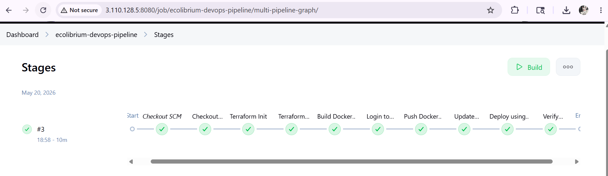

---

## Jenkins Dashboard

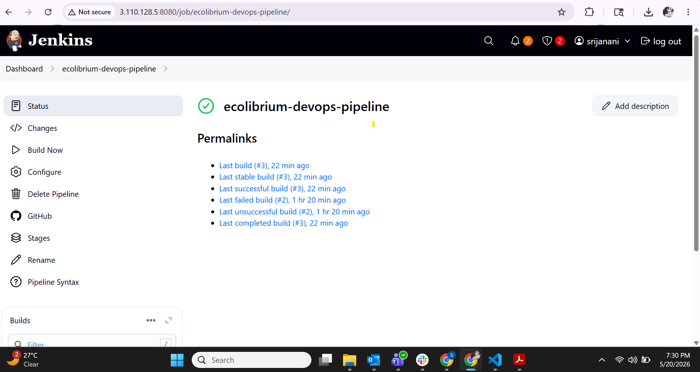

---

## Kubernetes Pods and Nodes

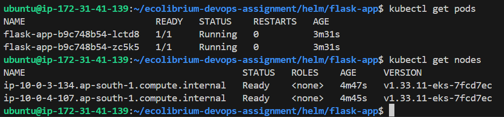

---

## Kubernetes Services

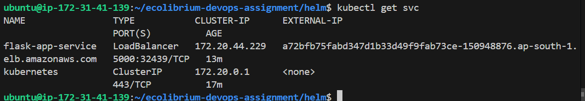

---

## Kubernetes Service Description

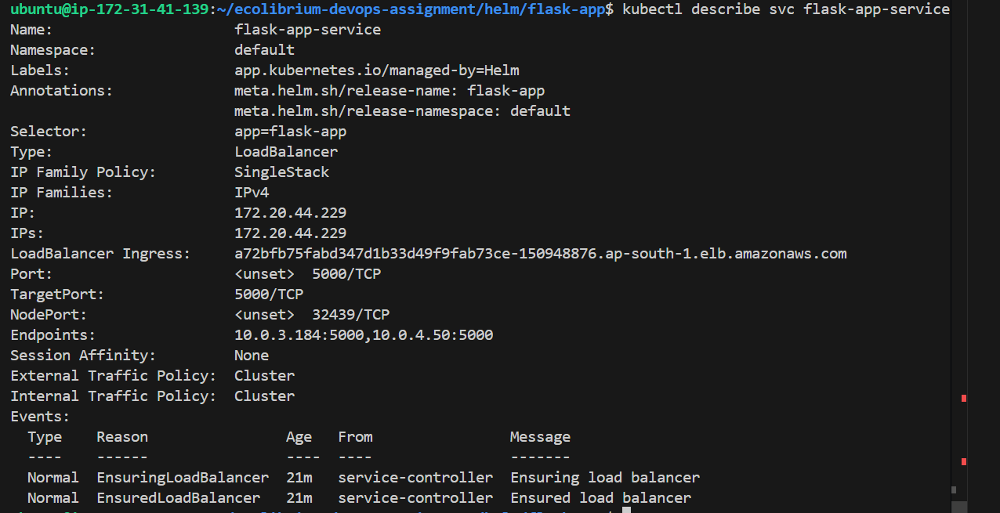

---

## Kubernetes Pod Description

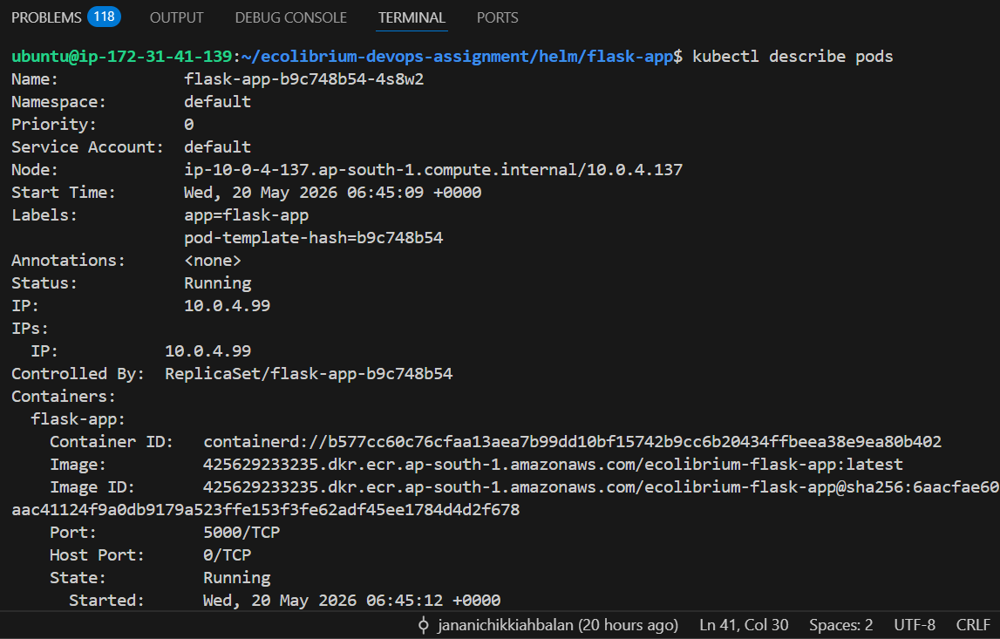

---

## Helm Deployment

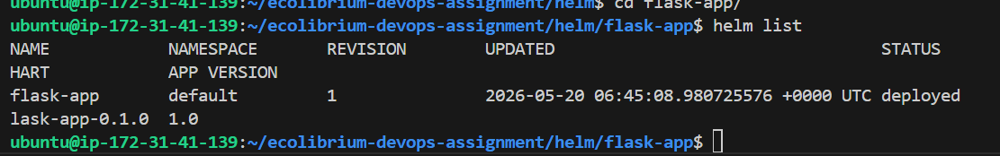

---

## Flask Application Running

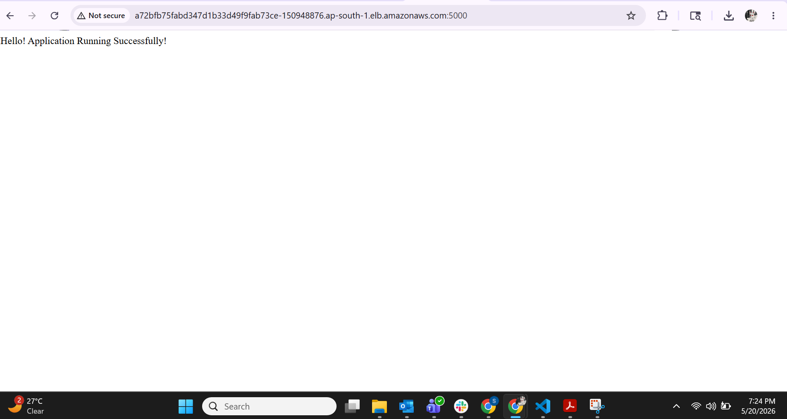

---

## Health Endpoint

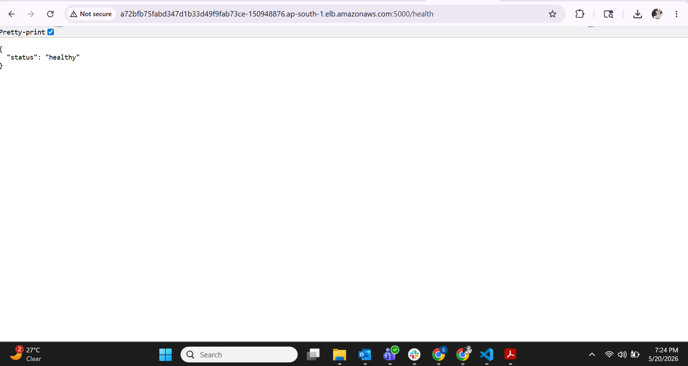

---

## EKS Cluster

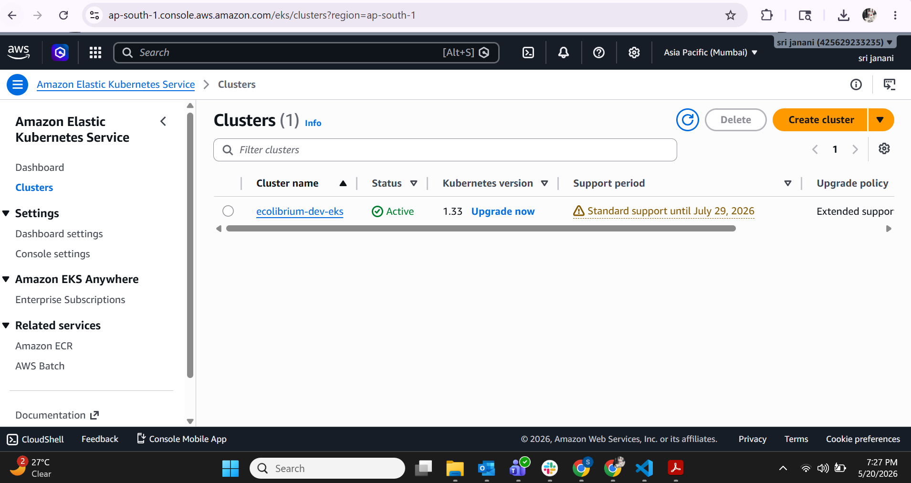

---

## EKS Cluster Details

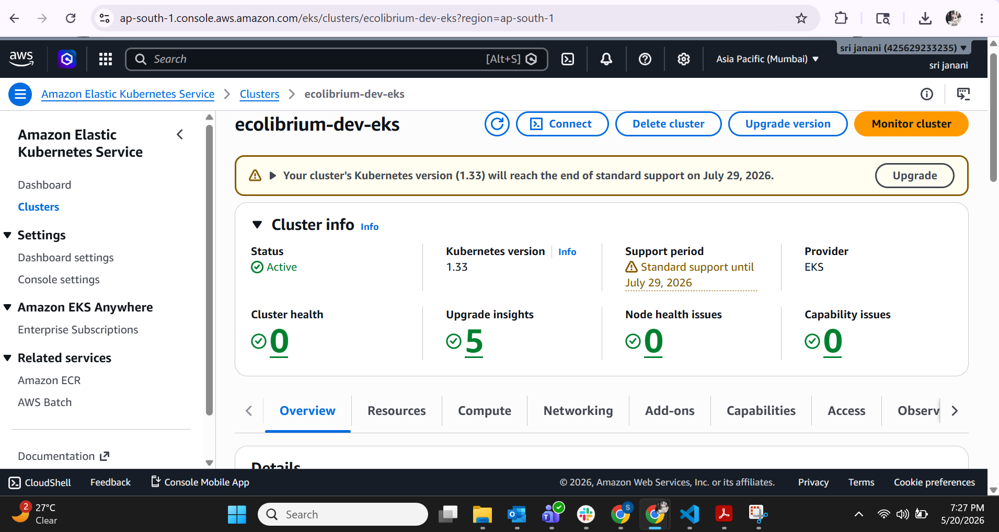

---

## EKS Node Group

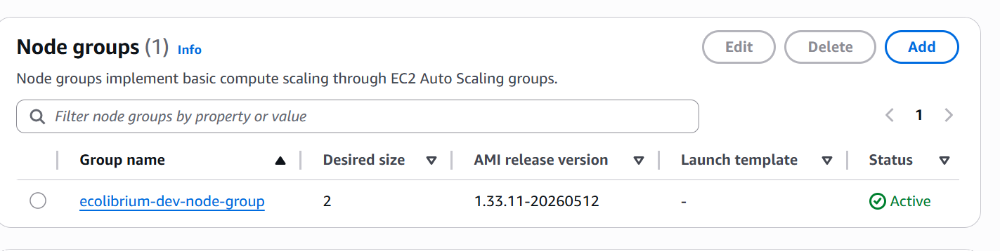

---

## Amazon ECR Repository

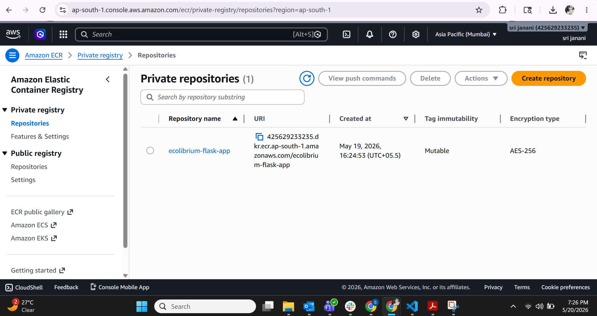

---

## Amazon ECR Image Details

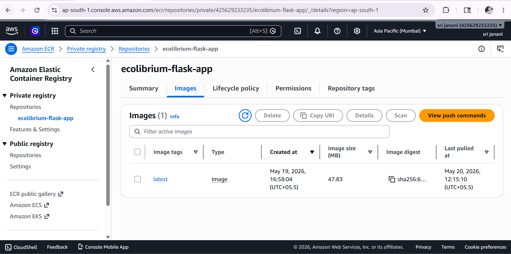

---

## Terraform Apply

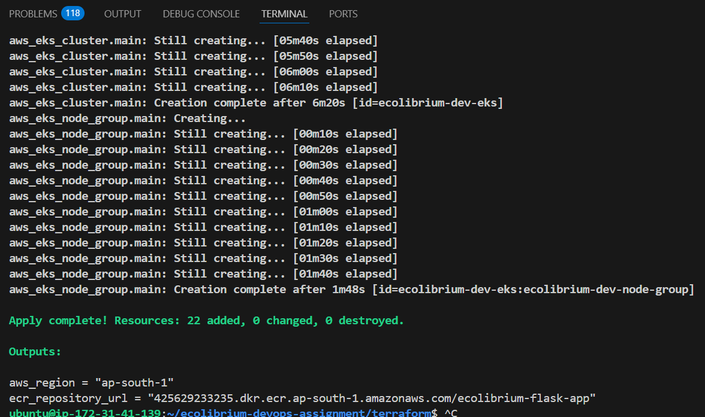

---

## Terraform State

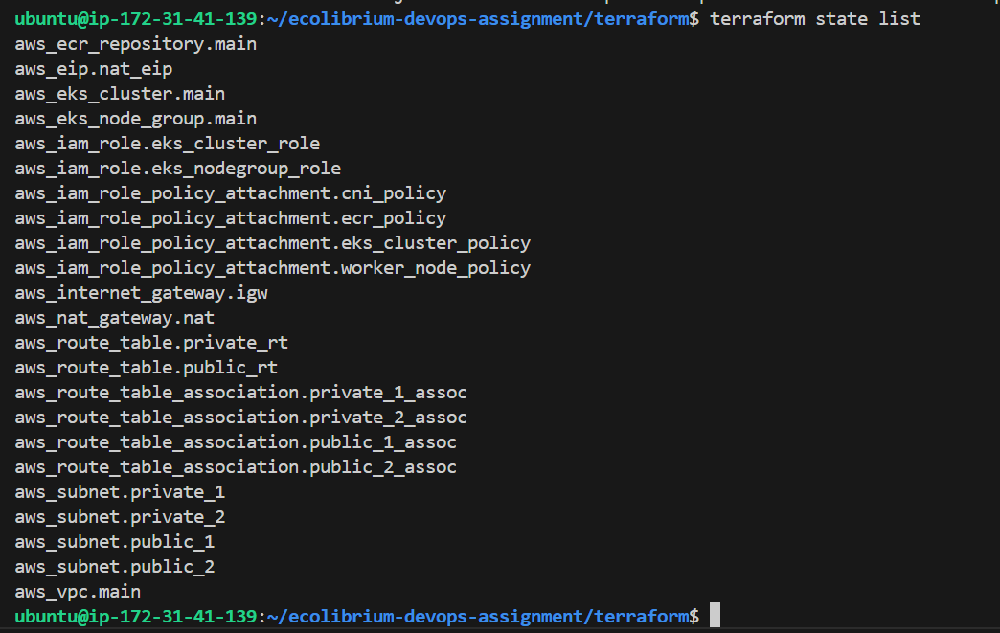

---

## Full Project Structure

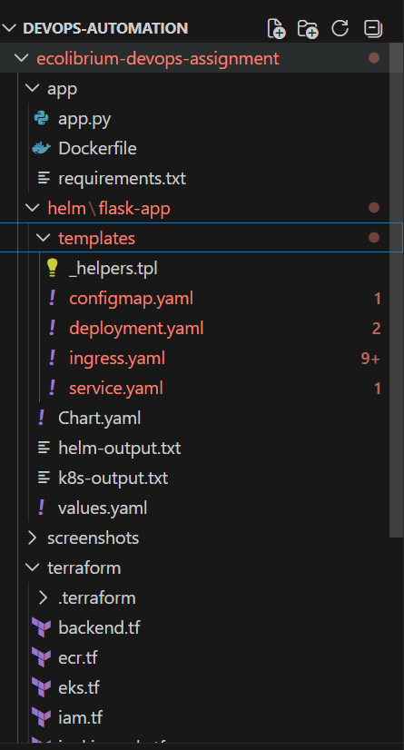
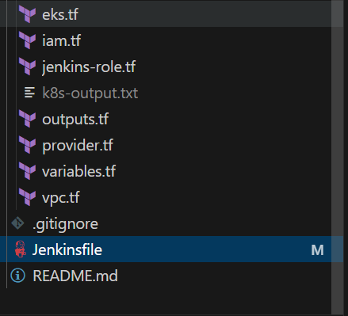

---

# Outcome

Successfully implemented a complete DevOps workflow using:

- Terraform
- Amazon EKS
- Docker
- Amazon ECR
- Helm
- Jenkins CI/CD

The application was successfully deployed and accessed through an AWS LoadBalancer running on Amazon EKS.